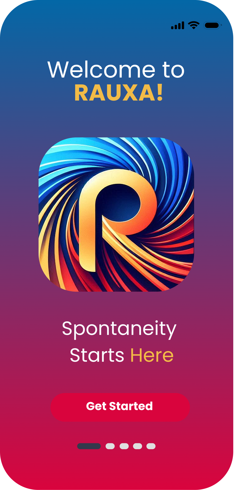
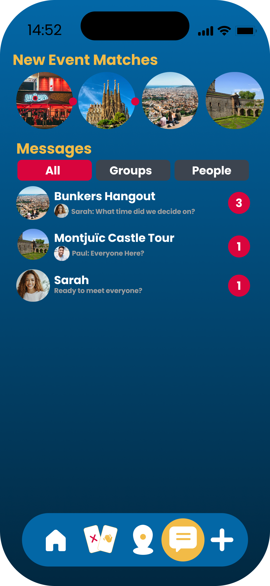
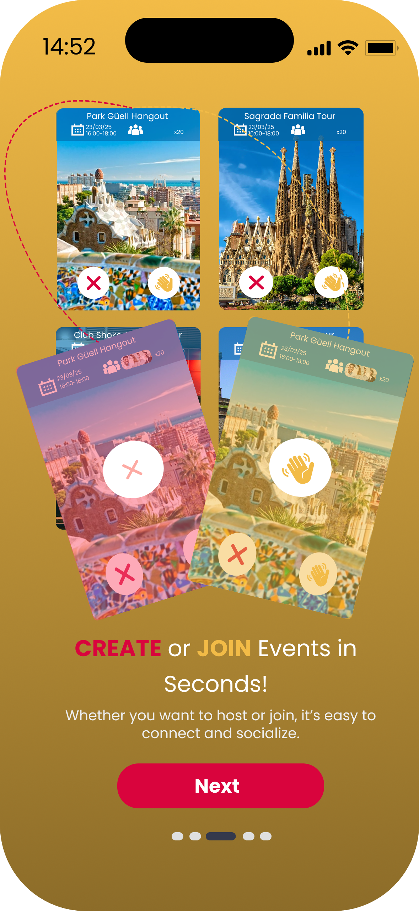
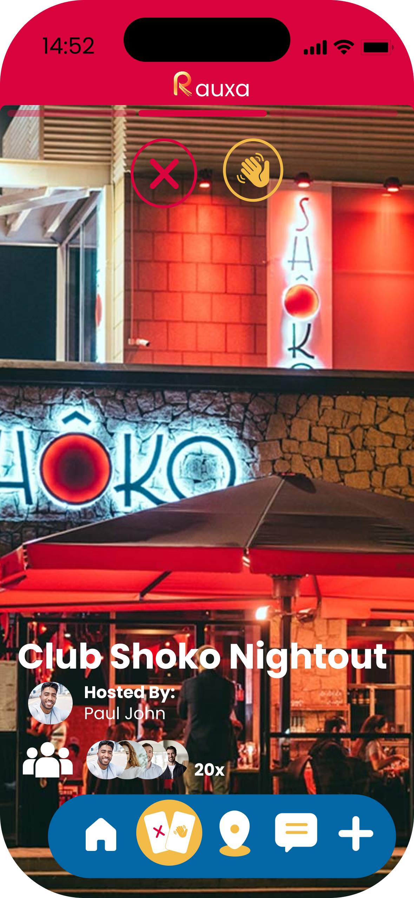

# Rauxa - Social and Event Matching App


Welcome to the Rauxa project! Rauxa is an innovative mobile app that helps users find events and connect with people based on their preferences and location. Built with a focus on real-time social interactions, event-based matchmaking, and user-friendly experiences, Rauxa aims to simplify event discovery and enhance social engagement.

This repository contains the source code for the Rauxa mobile app, developed using **Expo**, **React Native**, and **Firebase**.

---

## 📱 App Prototype

Here are some images of the app prototype showcasing the user interface of Rauxa across multiple devices:

<p align="center">
  
  
  
  
</p>

---

## ⚙️ Tech Stack

Rauxa uses a combination of modern tools and technologies to deliver an intuitive, fast, and scalable mobile application.

### Frontend:
- **React Native**: Framework for building cross-platform mobile apps with native performance.
- **Expo**: A development platform for React Native that provides tools to streamline the development and deployment process.

### Backend:
- **Firebase**: Backend-as-a-Service (BaaS) platform providing:
  - **Firestore**: A real-time NoSQL database for storing user data and events.
  - **Firebase Authentication**: For user sign-ups and sign-ins.
  - **Firebase Functions**: Serverless cloud functions for backend logic.
  - **Firebase Hosting**: Hosting the app and static assets.
  - **Firebase Storage**: For managing and storing media files like profile pictures.

### Other Tools & Libraries:
- **React Navigation**: Navigation library for handling in-app transitions and navigation.
- **React Native Maps**: For location-based features, including event geofencing.
- **Redux**: State management for global app states.

---

## 🖥️ How to Run Locally

Follow these steps to set up the Rauxa project on your local machine.

### Prerequisites:
- **Node.js** (v14 or higher)
- **npm** (or **yarn** as an alternative package manager)
- **Expo CLI**: Make sure you have the Expo CLI installed globally.
  ```bash
  npm install -g expo-cli ```

### 1. Clone the repository:
  ```bash
  git clone https://github.com/yourusername/rauxa.git
  cd rauxa
```
### 2. Install dependencies:
Run the following command to install all required packages:
 ```bash
  npm install
```
or if you use yarn:
 ```bash
  yarn install
```
### 3. Set up Firebase:
1. Create a Firebase project in the Firebase Console.
2. Set up Firestore, Authentication, and other necessary Firebase services in the Firebase Console.
3. In the root directory of your project, create a .env file and add your Firebase credentials (API keys, database URL, etc.) as environment variables.

Example:
 ```bash
FIREBASE_API_KEY=your-firebase-api-key
FIREBASE_AUTH_DOMAIN=your-auth-domain
FIREBASE_PROJECT_ID=your-project-id
FIREBASE_STORAGE_BUCKET=your-storage-bucket
FIREBASE_MESSAGING_SENDER_ID=your-sender-id
FIREBASE_APP_ID=your-app-id
```
### 4. Run the app in development mode:
Start the app with Expo CLI:
 ```bash
expo start
```
This will open the Expo developer tools in your browser. Scan the QR code with the Expo Go app on your mobile device or press i for iOS simulator or a for Android emulator to view the app locally.

## 📄 License
This project is licensed under the MIT License - see the LICENSE file for details.


